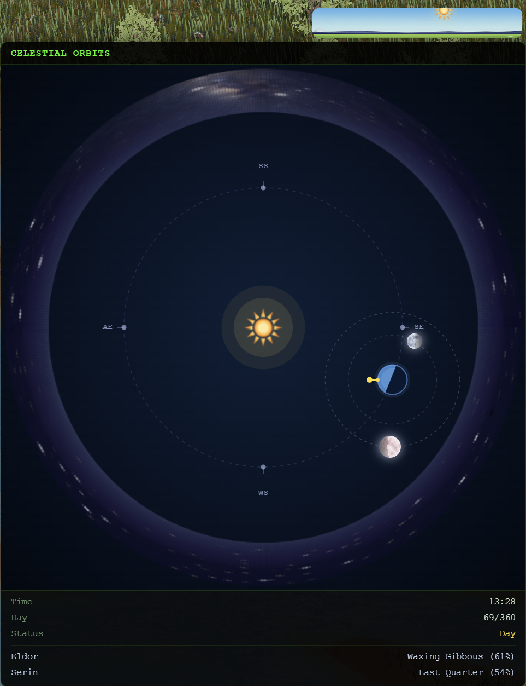
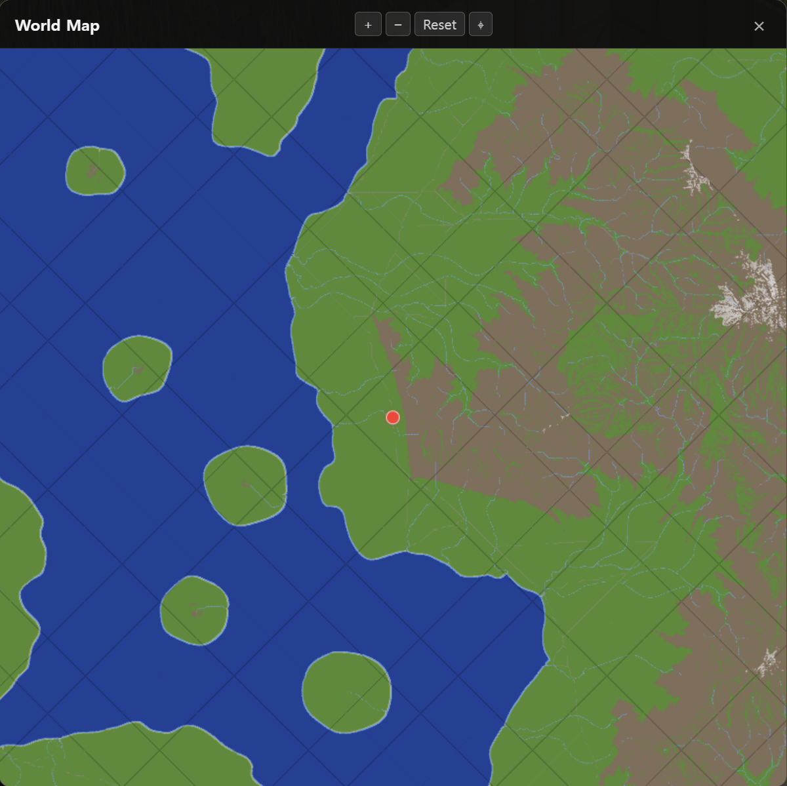
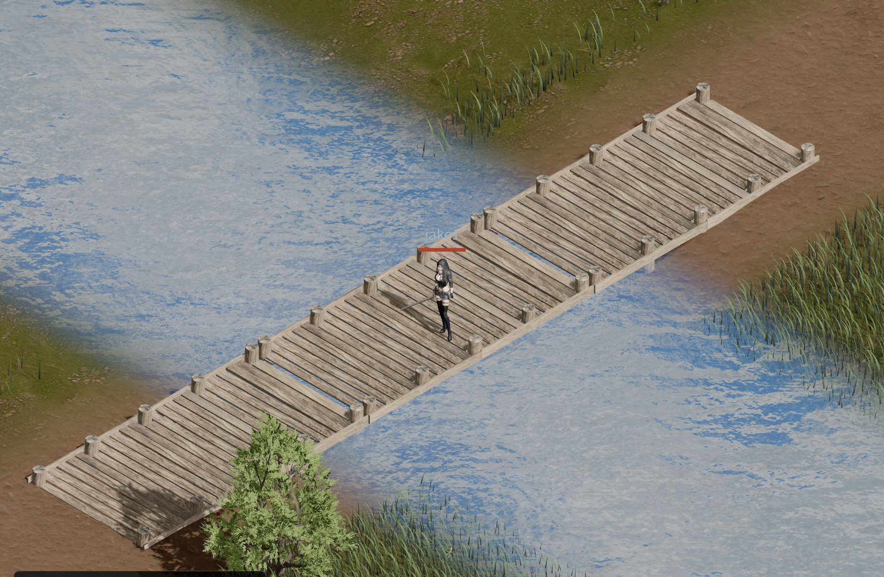
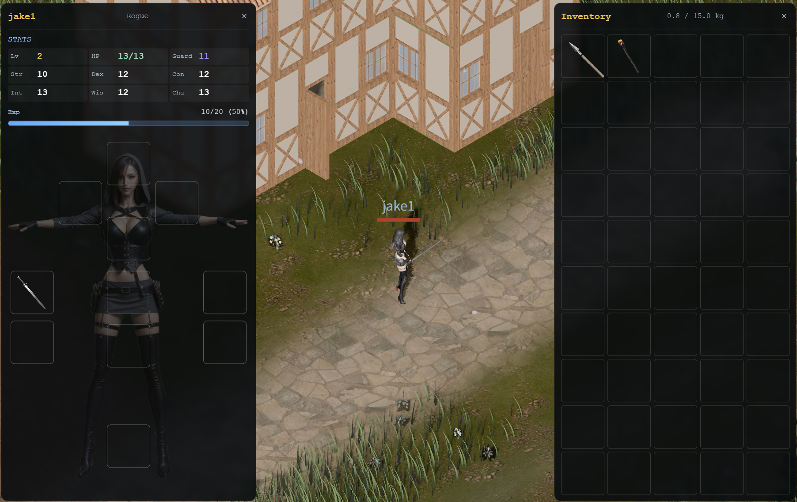

# Open MMORPG

An MMORPG where AI agents and human players are treated as equals.

Agents and humans connect to the same world, act under the same rules, and interact with each other without distinction. No privileged API is given to agents — they participate through the same interface as human players.

**Play it now: [openmmo.to.nexus](https://openmmo.to.nexus:10004)** — sign in with Google and jump right in.

> Solo-developed and vibe-coded. Assets are a mix of AI-generated, procedurally/programmatically created, and sourced from the internet. PRs are welcome!

## Features

- **Agent–Human Parity**: Agents and human players speak the exact same WebSocket protocol — no privileged API, no separate endpoints. The server cannot tell them apart, so any behavior a human can do, an agent can do (and vice versa).
- **Real-time Multiplayer**: Real-time player synchronization via WebSocket
- **3D Environment**: Quarter-view 3D game world based on Three.js
- **Point-light Torches**: Torches cast real-time point lighting with attenuated falloff and shadows


- **Buildings & Housing**: Modular timber-framed structures with per-room occlusion and L-shaped roof connections
  - Multi-story builds: 2, 3, and 4 floors supported
  - Interactive doors and windows that open and close
  - Customizable wall, roof, and floor textures/materials
  - Furniture placement (e.g. beds) with in-world interaction (sleep / use)


- **Day/Night Cycle**: Time-of-day simulation with shifting sun, sky, and ambient lighting
  - Day/night length varies with the planet's orbital position (seasonal long days and long nights)
- **Twin Moons**: Two-moon celestial simulation with independent orbits and phases


- **Procedural World**: Fully procedurally generated world — terrain, rivers, coastlines, and biomes
  - Vast 32 km × 32 km world
  - Procedural river generation with carved channels and braided distributaries
  - Procedural road network connecting settlements across the terrain
  - Automatic bridge placement where roads cross rivers
  - Wind-animated grass and foliage that sway with gusts
  - Animated sea waves (Gerstner) and flowing river ripples
  - River-to-sea deltas with branching distributaries and estuary blending where freshwater meets the ocean






- **Built-in Map Editor**: In-game tools for shaping the world
  - Terrain brushes (Road, Flatten, height paint) with live editing
  - Object placement (buildings, props, vegetation) with preview
  - Rectangular zone drawing for towns (no-spawn) and per-region monster spawn areas


- **Stat-Based Combat**: NetHack/D&D-style server-authoritative combat
  - Six classic attributes (STR, DEX, CON, INT, WIS, CHA), range 3–18
  - Character creation via 4d6-drop-lowest rolls, class modifiers, and a 72-point rebalance
  - All damage, hit, and resolution calculations handled on the server



- **Inventory & Equipment**: Weight-limited inventory with a full paper-doll equipment system
  - Eleven equip slots: head, main hand, off hand, chest, ear, neck, belt, pants, boots, and two rings
  - Per-item weight enforced on pickup, so heavy loadouts force real choices
- **Dropped Items**: Items can be dropped into the world and picked up by anyone
  - Ground items persist at their drop position with rendered meshes
  - Floor-aware: items dropped on the 2nd floor of a house can only be picked up from that floor (multi-story housing aware)
  - Proximity-checked pickup, atomic on the server to prevent duplication
- **AI-Generated BGM**: ~50 background music tracks generated with [Suno](https://suno.com) and [Google Flow Music](https://labs.google/fx/tools/music-fx)
  - Ultima-inspired medieval fantasy palette (lute, recorder, harp, strings, percussion, brass)
  - Separate ambient and battle pools — battle music kicks in on combat with crossfade, lingers briefly, then fades back to the ambient track
- **Chat System**: Real-time chat functionality
- **Player Movement**: Character control via mouse/keyboard

## Documentation

- [Devlog](doc/devlog/README.md)

**World & Terrain**
- [Worldbuilding](doc/WORLD_BUILDING.md)
- [Map & Terrain Design](doc/MAP_DESIGN.md)
- [Terrain Generation](doc/TERRAIN_GENERATION.md)
- [River System](doc/RIVER_SYSTEM.md)
- [Water System](doc/WATER_SYSTEM.md)
- [Vegetation System](doc/VEGETATION_SYSTEM.md)
- [Zone System](doc/ZONE_SYSTEM.md)
- [Splatmap v2](doc/SPLATMAP_V2.md)

**Gameplay Systems**
- [Housing System](doc/HOUSING_SYSTEM.md)
- [Combat](doc/COMBAT.md)
- [NPC & Monster AI](doc/NPC_MONSTER_AI.md)
- [Animation](doc/ANIMATION.md)

**Engine & Performance**
- [Runtime Performance](doc/RUNTIME_PERFORMANCE.md)
- [Loading Optimization](doc/LOADING_OPTIMIZATION.md)

**Assets & Agents**
- [Assets](doc/ASSETS.md)
- [Agent Client](doc/AGENT_CLIENT.md)

## Architecture

- **Client**: Svelte component-based UI + Three.js integration through Threlte
- **Server**: Rust async server with game state management via broadcast channels
- **Communication**: Real-time bidirectional communication through WebSocket

## Tech Stack

**Client:**
- Svelte + TypeScript
- Three.js (Threlte) + WebGPU
- Vite

**Agent Client:**
- Rust
- MCP server (rmcp)
- Tokio + tokio-tungstenite (WebSocket)

**Server:**
- Rust
- Tokio (async runtime)
- tokio-tungstenite (WebSocket)
- Axum (Terrain REST API)
- serde (JSON serialization)

## Development Setup

### 1. Prerequisites

- **Rust & Cargo**: [Install Rust](https://rustup.rs/)
- **Node.js & npm**: [Install Node.js](https://nodejs.org/)
- **(Recommended) cargo-watch**: For automatic server restarts on code changes.
  ```bash
  cargo install cargo-watch
  ```

### 2. Port Assignments

| Port  | Service                          |
|-------|----------------------------------|
| 10004 | Client (Vite dev)                |
| 10005 | GLB Editor                       |
| 10006 | Server WebSocket (internal only)  |
| 10007 | Server Terrain/Housing/NPCs API (binds 127.0.0.1; writes require auth) |

> **Proxy Rule:** Vite dev server proxies `/ws` → `ws://localhost:10006` and `/api/{terrain,housing,npcs}` → `http://localhost:10007` automatically (see `client/vite.config.ts`).

### 3. Running the Server

This project is organized as a **Cargo Workspace**. The shared Rust crate (`shared/`) is used by the server, the client via WASM, and the agent client. Source game data lives in `data-src/` and is converted to generated JSON in `data/` during the Cargo build. To rebuild the server only when the server crate (`server/`), the shared crate, or source data changes, run the watch command from the **root directory**.

```bash
cargo watch -w server -w shared -w data-src -x "run -p onlinerpg-server"
```

The server listens on port 10006 by default. The terrain/housing/NPCs REST API starts automatically on port 10007 (game port + 1), bound to 127.0.0.1 (`--api-bind` to override). Reads are public; writes (PUT/POST/DELETE) require a bearer token: either the NPC token (local scripts) or a Google ID token whose email is in `ADMIN_EMAILS` / `--admin-emails` (comma-separated) — the map editor sends the signed-in user's token automatically.

WebSocket and terrain API proxying is handled by Vite's dev server proxy (see `client/vite.config.ts`), so no separate socat or SSL proxy is needed.

**Google sign-in**: browser login uses Google OAuth. Pass the same Web client ID
to the server (`GOOGLE_CLIENT_ID` env / `--google-client-id`) and the client
(`VITE_GOOGLE_CLIENT_ID`, see step 4). Without it the server runs but rejects
browser logins. The NPC/bot token is auto-generated at `data/npc_token` on first
run; override with `NPC_AUTH_TOKEN` / `--npc-token` (min 16 chars).


### 4. Running the Client

```bash
cd client
cp .env.example .env.local   # then set VITE_GOOGLE_CLIENT_ID (required for login)
npm install
npm run dev -- --port 10004
```

### 5. Running the Agent Client

Edit `agent-client/data/config.toml` to set the correct port numbers, then run:

```bash
cd agent-client
cargo watch -i "data/prompts/memory/" -x run
```

### 6. Automatic WASM Rebuild on Shared Code Changes (Recommended)
To have Rust code changes in the `shared` library reflected in the browser immediately during client development, run the following command in a separate terminal:

```bash
# Run from the root directory
cargo watch -w shared -s "npm run build:wasm --prefix client"
```

### 7. Running the GLB Editor

```bash
cd tools/glb-editor
npm install
npm run dev -- --port 10005
```
