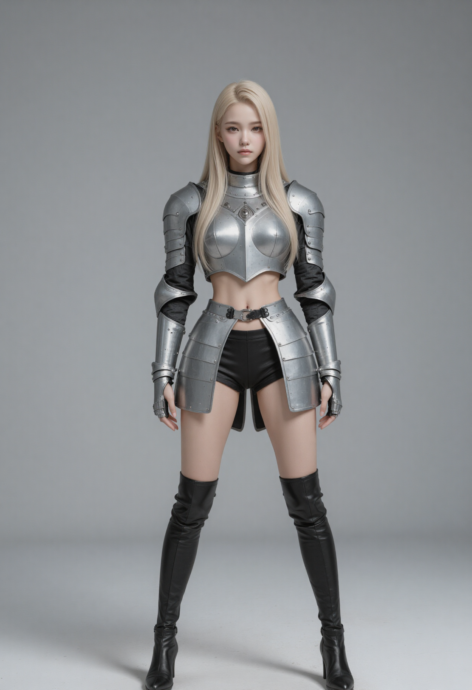
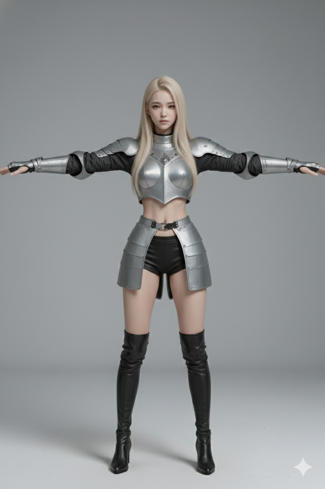
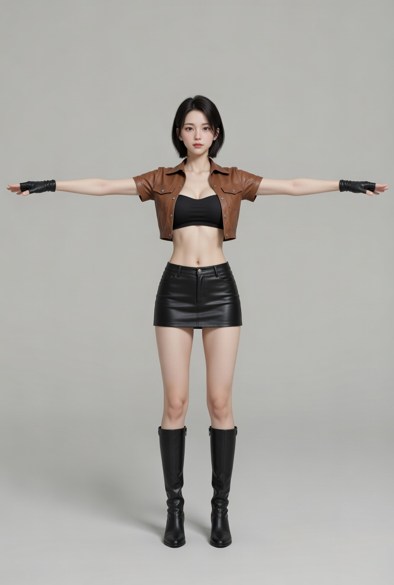
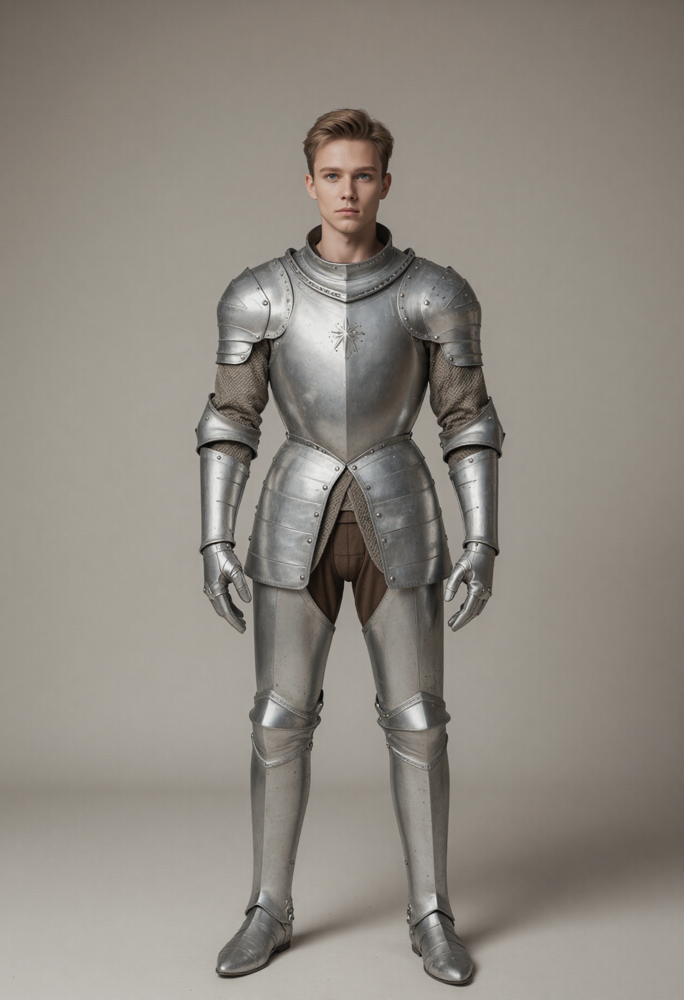

# Asset URLs

- 애니메이션 파이프라인/매핑 규칙 문서: [ANIMATION.md](./ANIMATION.md)

## grass

- https://sketchfab.com/3d-models/realistic-grass-pack-for-games-free-9b958d613e9a44dbba580748e7a1789c
- "Grass Bursh Displacement A EO 001" (https://skfb.ly/ptwqv) by osoedwin is licensed under Creative Commons Attribution (http://creativecommons.org/licenses/by/4.0/).
- "Grass Bursh Displacement B EO 001" (https://skfb.ly/ptwQN) by osoedwin is licensed under Creative Commons Attribution (http://creativecommons.org/licenses/by/4.0/).
- "Yard Grass" (https://skfb.ly/6VxNM) by ebmclachlan is licensed under Creative Commons Attribution (http://creativecommons.org/licenses/by/4.0/).
- "Animated_grass\_-_vegetation" (https://skfb.ly/pyEME) by Savatar illusions is licensed under Creative Commons Attribution (http://creativecommons.org/licenses/by/4.0/).

## terrain

- 자갈: https://polyhaven.com/a/gravel_floor
- 잔디: https://polyhaven.com/a/rocky_terrain_02
- 눈: https://polyhaven.com/a/snow_02
- 흙: https://polyhaven.com/a/red_laterite_soil_stones
- 모래: https://polyhaven.com/a/sandy_gravel_02
- 해안 모래: https://sketchfab.com/3d-models/fine-sand-material-6e54464d405a4c1e8bdb0f81e8d74db2

## sea

- sea https://www.filterforge.com/filters/4141.html
- sea foam https://www.filterforge.com/filters/13843.html

## human

- https://sketchfab.com/3d-models/blake-slim-walk-c4d-c076264ca7394357bf3f17837edd72c9
- https://sketchfab.com/3d-models/xbot-049e4a44ad8b449dba8a2c4824502f5c
- "Beauty Girl Exercising - Undressed Workout" (https://skfb.ly/pxpoo) by Polygonal Studios is licensed under Creative Commons Attribution (http://creativecommons.org/licenses/by/4.0/).
- "Beautiful Realistic Undressed Girls - 14 Anims" (https://skfb.ly/pxpoH) by Polygonal Studios is licensed under Creative Commons Attribution (http://creativecommons.org/licenses/by/4.0/).
- "Mutant Mixamo" (https://skfb.ly/6DvxK) by NAZTart is licensed under Creative Commons Attribution (http://creativecommons.org/licenses/by/4.0/).
- "MIXAMO" (https://skfb.ly/ottKO) by sdhkim is licensed under Creative Commons Attribution (http://creativecommons.org/licenses/by/4.0/).
- "Bandit Armor and Clothes - Game Model" (https://skfb.ly/6UVot) by wolkoed is licensed under Creative Commons Attribution (http://creativecommons.org/licenses/by/4.0/).
- Maria https://sketchfab.com/3d-models/maria-a04cac95ab8046e4bbdc9dec30c7d92d
- dying https://sketchfab.com/3d-models/dying-98a1d5b2288d49d993039cb161913cd3
- medieval_knight https://sketchfab.com/3d-models/medieval-knight-sculpture-game-ready-6cdd055b4afa41eb9360dbbfe75c7f10

### female_knight 
  - ComfyUI에서 jibMixZIT_v10.safetensors로 원화 생성 
  - Nano banana에서 T 포즈로 변형 
  - meshy.ai에서 3d 모델로 변환 -> 10k 모델로 리매쉬
  - mixamo.com에서 리깅 및 애니메이션 부착
  - blender에서 스케일/위치 조정(rest pose 원점 발 밑에 오게) -> 매터리얼 조정 (Shader Editor에서 Alpha 끊기) -> .glb 내보내기
  - tools/glb-editor에서 `본 이름 표준화`

### thief
  - female_knight와 같은 workflow
  - 원화 
  - grok으로 T-pose(나노 바나나가 말을 안들어서) 

### knight
  - female_knight와 같은 workflow
  - 원화 
  - nano banana2로 A 포즈 

### animations

- mixamo.com에서 받은 fbx를 blender에서 scale 10으로 임포트한다

- Medea By M. Arrebola https://www.mixamo.com/#/?page=1&query=&type=Character
- Walking https://www.mixamo.com/#/?page=1&query=walk&type=Motion%2CMotionPack
- Catwalk Walk Forward https://www.mixamo.com/#/?page=2&query=walk&type=Motion%2CMotionPack
- Standing Torch Walk Forward
- Catwalk Walking

- Run (허리구부리고) https://www.mixamo.com/#/?page=1&query=run&type=Motion%2CMotionPack
- Slow Run https://www.mixamo.com/#/?page=1&query=run&type=Motion%2CMotionPack
- Jogging https://www.mixamo.com/#/?page=1&query=jog&type=Motion%2CMotionPack

- Standing Idle https://www.mixamo.com/#/?page=1&query=idle&type=Motion%2CMotionPack
- Happy Idle
- Dwarf Idle
- Offensive Idle https://www.mixamo.com/#/?page=2&query=idle&type=Motion%2CMotionPack
- Sword And Shield Idle

- Sword and Shield Slash https://www.mixamo.com/#/?page=1&query=slash&type=Motion%2CMotionPack

## Monster

- SCP939 https://sketchfab.com/3d-models/scp939-79a749a5073b453d9d85875797bf45d7

## Item

- sword.glb https://www.fab.com/listings/5fe82d66-eaac-48e0-899d-1fedacdf409a

## Terrain

- https://tangrams.github.io/heightmapper/#11.16667/34.4293/126.4164
- export PATH="$HOME/.local/bin:$PATH" && rm -rf data/terrain/height/r*/h_*.bin && find data/terrain/height/ -type d -empty -delete 2>/dev/null; uv run --with Pillow --with numpy tools/import_heightmap.py     client/public/textures/height_map.png     --min-height -7 --max-height 60     --origin-tile -29 -31     --terrain-dir data/terrain

# Blender

- Use version 5.0.1
- blender-scripts
  - fix_mixamo_transforms.py
  
    mixamo에서 import한 armature와 mesh가 각각 scale이 0.01, 100.0으로 되어 있는 것을 1.0, 1.0으로 맞춰준다.
  
  - add_action_to_nla.py
    
    mixamo에서 import한 메쉬없는 애니메이션을 최초의 armature에 붙여준다

## Import tips

- .glb를 import 할 때 거대한 구가 나타나는 경우 bone shape scale을 0.01로 하면 거대한 구체가 나타나는 것을 방지할 수 있다.

## Export tips

- Backface Culling: Material Properties → Settings → Backface Culling 켜기(뒷면 제거).
- Shader Editor 활성화
  - Alpha가 의도치 않게 들어가 있는지: Base Color 텍스처에 알파가 섞여 Alpha에 연결돼 있지 않은지 확인.
- .glb 내보내기 시 권장 옵션(Blender glTF 2.0 Exporter)
  - Apply Modifiers: 켜기
  - (노멀맵 쓴다면) Tangents: 켜기

## Splat Map용 텍스처 GLB 내보내기

- Plane의 크기는 상관없다. 코드에서 geometry는 무시하고 material의 텍스처만 추출한다.
  - `splatLayerLoader.ts`가 GLB를 로드한 뒤 첫 번째 `MeshStandardMaterial`에서 `map`, `normalMap`, `roughnessMap`, `metalnessMap`, `aoMap`만 꺼내 쓴다.
  - 터레인 geometry는 별도로 `PlaneGeometry(64, 64)`를 생성한다.
- 중요한 것은 Blender에서 material에 올바른 텍스처(albedo, normal, roughness 등)가 할당되어 있는지이다.

## Icon

- https://icon-sets.iconify.design/fa6-solid/people-group/
