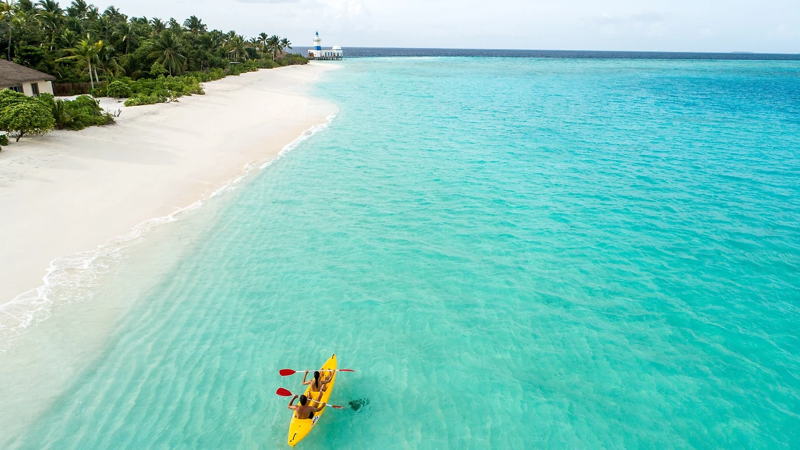

# 수계 시스템 (Water System)

바다 수면 렌더링 시스템의 기술적 사양. 지형 시스템과 연동하여 해수면 이하 타일에 물을 자동 배치한다.

## 1. 개요

*   아래 레퍼런스 이미지와 같은 얕은 열대 해변의 투명한 터콰이즈 바다를 목표로 렌더링한다.

    

*   해수면(Y=0) 이하 높이를 가진 타일에 물 메쉬를 자동 생성한다.
*   물 메쉬는 지형과 동일한 지오메트리(64×64 세그먼트)를 공유하며, Y=0.01 위치에 배치한다.
*   매 프레임 3-패스 렌더링: 굴절(refraction) → 반사(reflection) → 메인 렌더.

## 2. 멀티패스 렌더링

### 2.1 굴절 패스 (Refraction Pass)

*   물 메쉬를 숨기고 씬을 절반 해상도로 렌더링하여 굴절 텍스처를 생성한다.
*   물 셰이더에서 표면 노멀로 UV를 왜곡하여 수중 지형이 굴절되어 보이는 효과를 낸다.
*   파일: `client/src/lib/managers/refractionRenderManager.ts`

### 2.2 반사 패스 (Reflection Pass)

*   카메라를 해수면(Y=0) 기준으로 Y축 반전하여 엔티티만 절반 해상도로 렌더링한다.
*   지형과 물은 숨기고 엔티티(캐릭터, 몬스터 등)만 반사에 포함된다.
*   ClippingGroup: `three/webgpu`의 `ClippingGroup`으로 엔티티 계층을 감싸고, 클리핑 평면 `normal(0,1,0), d=0`을 설정하여 수면 아래 프래그먼트를 제거한다. 반사 렌더 시에만 `enabled=true`로 토글.
*   투명 배경(alpha=0)으로 렌더링하여 엔티티가 없는 영역을 alpha 채널로 구분한다.
*   파일: `client/src/lib/managers/reflectionRenderManager.ts`

## 3. 물 셰이더 (Water Material)

WebGPU TSL(Three.js Shading Language) 노드 기반 커스텀 셰이더.

파일: `client/src/lib/shaders/water-material.ts`

### 3.1 버텍스 단계: Gerstner Wave

*   3개의 Gerstner Wave를 합산하여 수면의 물리적 파동을 시뮬레이션한다.
*   Gerstner Wave는 사인파와 달리 파봉이 뾰족하고 파곡이 넓은 자연스러운 해양 파동을 생성한다.
*   타일 경계 이음새 방지를 위해 Y축(수직) 변위만 적용한다 (X/Z 이동 없음).
*   파라미터 (방향, 회전속도, Steepness, Wavelength):
    *   Wave A: 랜덤 초기각, 0.0013 rad/s, 0.06, 20m
    *   Wave B: 랜덤 초기각, 0.0021 rad/s, 0.04, 14m
    *   Wave C: 랜덤 초기각, 0.0009 rad/s, 0.03, 9m
*   파동 방향은 시간에 따라 천천히 회전하며(angle + elapsed × speed), 모듈 레벨에서 공유되어 모든 타일이 동일한 방향을 사용한다.
*   **얕은 물 감쇠**: 하이트맵에서 수심을 샘플링하여 depth 0~1.5 범위에서 smoothstep으로 파동을 감쇠시킨다.
*   **해석적 노멀 계산**: `gerstnerNormal()` TSL 함수가 각 파동의 편미분(tangent/bitangent)을 반환하여 분석적으로 표면 노멀을 합산한다.

### 3.2 프래그먼트 단계

셰이더의 프래그먼트 처리 흐름:

1.  **수심 계산:** 하이트맵 텍스처에서 지형 높이를 읽어 수면과의 깊이(depth)를 계산한다. UV는 65×65 텍셀 중심 정렬 (`uv * 64/65 + 0.5/65`).
2.  **깊이 기반 색상:** 4단계 그라디언트로 수심에 따른 색상을 결정한다 (depthFactor = depth / 2.5).
    *   바다1(극얕은, 0~0.08): 민트 그린 (0.75, 0.88, 0.78)
    *   바다2(얕은, 0.08~0.25): 터콰이즈 (0.2, 0.58, 0.42)
    *   바다3(중간, 0.25~0.7): 짙은 터콰이즈-네이비 (0.02, 0.34, 0.32)
    *   바다4(깊은, 0.7~1.0): 딥 네이비 (0.002, 0.06, 0.18)
3.  **표면 노멀:** Gerstner 해석적 노멀(대형 파동)과 노멀맵 리플(세밀 요철)을 합산한다. 노멀맵은 3방향으로 파동 방향/위상 속도에 맞춰 UV를 이동하며 샘플링한다.
4.  **굴절:** 화면 UV를 표면 노멀 XZ로 왜곡(강도 0.04)하여 굴절 텍스처를 샘플링한다. Y-flip으로 WebGPU 렌더 타겟 좌표 보정. depthFactor 0~0.25 범위에서 70% 혼합, 깊은 곳에서 페이드.
5.  **야간 색상 감쇠:** 태양 고도에 따라 waterColor에 0.15~1.0 승수를 적용하여 밤에 어두운 물색을 유지한다.
6.  **수중 코스틱스(Caustics):** 초기화 시 한 번 생성한 정적 보로노이 텍스처를 셰이더에서 시간에 따라 UV를 이동시켜 2개 레이어로 샘플링, min 합성하여 애니메이션한다. 거품 텍스처를 디테일로 곱하고, 쉬머(shimmer) 효과로 반짝임을 추가한다. depthFactor 0.05~0.25에서 게이트되어 극얕은 곳에서는 보이지 않음. 밤에는 dim blue-grey 색조로 전환.
7.  **스페큘러 + 스파클:**
    *   Blinn-Phong 스페큘러(power 128): 부드러운 노멀(`mix(up, surfaceN, 0.3)`)로 넓은 반사.
    *   노멀맵(waternormals.jpg) 기반 스파클: 2-레이어 샘플링, 파봉(wave crest)에서 강화.
    *   주간: 태양 고도 연동 (0~0.3). 야간: 달빛 스파클(0.15 강도, 달이 보일 때만).
8.  **프레넬 반사:**
    *   **시선 방향 조작:** 프레넬 계산에 실제 카메라 Y 방향 대신 고정값 0.15를 사용 (`normalize(viewDir.x, 0.15, viewDir.z)`). 직교(ortho) 카메라는 모든 프래그먼트의 시선 방향이 동일하여 실제 값을 쓰면 프레넬 효과가 거의 보이지 않기 때문에, Y를 낮게 고정하여 수면을 비스듬히 보는 것처럼 프레넬을 강제한다.
    *   리플 밝기 변조: `1-NdotV` 기반으로 수면 밝기를 0.75~1.25 범위로 조절.
    *   얕은 곳에서 프레넬/스페큘러 감쇠 (투명 모래 바닥 보존).
    *   청록색 틴팅: 하늘 반사를 바다3 색상 방향으로 70% 틴팅하여 물색 유지.
9.  **절차적 하늘 반사:** 시간대별 3-팔레트 블렌딩:
    *   **밤**: 어두운 블루 (지면 0.02/0.03/0.06, 헤이즈 0.04/0.06/0.12, 천정 0.02/0.04/0.1)
    *   **박명**: 따뜻한 오렌지/퍼플 (헤이즈 0.7/0.35/0.15)
    *   **낮**: 시안 블루 (헤이즈 0.55/0.65/0.75, 천정 0.12/0.25/0.5)
    *   일출/일몰 시 sunColor로 헤이즈 틴팅. 태양 하이라이트 `pow(sunDot, 8) * 0.25`.
10. **엔티티 평면 반사:** 반사 텍스처에서 alpha > 0인 영역에 엔티티 반사를 혼합 (하늘 반사 대체 50%, 최종 색상 오버레이 30%).
11. **해안 후퇴 효과 (Shore Drawback):**
    *   사인파 기반 조석 진동: `sin(time * waveSpeed * 4π) * 0.5 + 0.5`, 거품 밴드 2배 주파수로 동기화.
    *   후퇴량 0.8로 depth를 오프셋하여 물이 밀려갔다 밀려오는 시각 효과.
    *   shore zone: `1 - smoothstep(0, 0.45, adjustedDepth)`.
12. **해안 구멍 (Shore Holes):**
    *   3-옥타브 value noise (주파수 0.2, 0.4, 0.08 / 가중치 0.5, 0.3, 0.2)로 불규칙한 물 경계 생성.
    *   `holeAlpha`: 노이즈가 임계값보다 낮은 곳에서 alpha=0이 되어 물이 사라지고 지형이 드러남.
    *   `holeEdge`: 구멍 경계에 거품 프린지 (임계값 -0.03 ~ +0.5 범위).
    *   `holeFoamFringe`: 구멍 안쪽에도 거품이 약간 보이도록 alpha 유지.
    *   결과적으로 수심이 있는(depth > 0) 영역에서도 노이즈에 의해 물이 그려지지 않아, 해수면 아래 지형이 육지 모래사장처럼 자연스럽게 드러나는 효과를 낸다.
13. **젖은 모래 효과 (Wet Sand):**
    *   구멍 경계(-0.55 ~ -0.05)에서 굴절(지형) 색상을 50% 어둡게 하여 젖은 모래 표현.
    *   조석 인식: 썰물 시 빠르게 나타나고(`smoothstep(0.05, 0.15, recede)`), 밀물 시 빠르게 사라짐(`smoothstep(0.85, 0.9, recede)`). `cos(phase)`로 방향 감지.
14. **거품 밴드 (Foam Bands):**
    *   2개의 반주기(half-cycle) 파동 밴드가 depth 1.5(심해)에서 0.15(해안)으로 이동하며 교차 페이드.
    *   밴드 폭이 해안 접근 시 증가 (0.04 + 0.1 × progress, 파도 쇄파 효과).
    *   대규모 노이즈로 유기적 가장자리 생성. 거품 텍스처를 곱하여 패턴 적용.
    *   해안 구멍 경계에 별도 shore foam: 2-레이어 거품 텍스처(스케일 0.5/0.35), 주야 밝기 조절.
15. **거품 합성:** 순수 가산(additive) 블렌딩 — 물 색상 위에 흰색을 더한다 (색상 대체 아님).
    *   주간: 0.7 강도, 야간: 0.06 강도. 깊은 곳에서 마스킹(depthFactor 0.3~0.7).
    *   야간 감쇠(nightDarken) 이후에 거품을 더하여 거품 밝기가 보존됨.
16. **야간 감쇠:**
    *   기본: sunY 기반 0.25~1.0 승수로 수면 전체 어둡게.
    *   중간 수심(0.15~0.5) 추가 감쇠: 에메랄드 톤 억제.
    *   극얕은 바다1 영역에서 밤에 알파를 추가 감소 (×0.5).
17. **알파:** 수심에 따라 투명도를 조절한다.
    *   극얕은(0~0.08): 0.05 → 얕은(0.08~0.35): 0.35 → 깊은: 0.97.
    *   거품(×0.9) 및 스파클로 부스트 (최대 1.0).
    *   `holeAlpha`와 `holeFoamFringe`의 max로 해안 구멍 가장자리 처리.

## 4. 절차적 텍스처 생성

렌더링에 필요한 텍스처 중 일부는 런타임에 절차적으로 생성한다.

| 텍스처 | 해상도 | 생성 방식 | 파일 |
|--------|--------|-----------|------|
| 코스틱스 | 256×256 | 128셀 보로노이 거리 필드, `pow(d, 2.5)` 샤프닝 | `caustics-gen.ts` |

외부 텍스처(파일에서 로드):

| 텍스처 | 용도 | 파일 |
|--------|------|------|
| 노멀맵 | 리플 노멀 + 스파클 패턴 (three.js 예제에서 가져옴) | `client/public/textures/waternormals.jpg` |
| 거품(foam) | 해안 거품 패턴 + 코스틱스 디테일 (원본을 흑백 변환 후 min-max 스트레치 적용) | `client/public/textures/13843.png` |

파일: `client/src/lib/shaders/water-foam-gen.ts`

## 5. 타일 관리

*   물은 지형 타일 단위로 관리된다. `TerrainHeightManager.hasWater()`로 타일에 해수면 이하 버텍스가 있는지 판별한다.
*   타일별로 65×65 하이트맵 DataTexture를 생성하여 물 셰이더에 전달한다 (수심 계산용).
*   높이 브러시로 지형을 편집하면 물 타일이 실시간으로 추가/제거/갱신된다.
*   인접 타일의 공유 경계가 변경되면 이웃 물 타일도 갱신된다.
*   파일: `client/src/lib/components/game-scene/GameSceneWaterLayer.svelte`

## 6. 핵심 파일

| 파일 | 역할 |
|------|------|
| `client/src/lib/shaders/water-material.ts` | 물 셰이더 (Gerstner + 프래그먼트 전체) |
| `client/src/lib/shaders/water-normal-gen.ts` | 절차적 노멀맵 생성 |
| `client/src/lib/shaders/water-foam-gen.ts` | 거품/수면 텍스처 로더 |
| `client/src/lib/shaders/caustics-gen.ts` | 절차적 코스틱스 텍스처 생성 |
| `client/src/lib/components/WaterTile.svelte` | 물 타일 컴포넌트 (머티리얼 생성·유니폼 갱신) |
| `client/src/lib/components/game-scene/GameSceneWaterLayer.svelte` | 물 타일 관리 레이어 |
| `client/src/lib/managers/refractionRenderManager.ts` | 굴절 렌더 패스 |
| `client/src/lib/managers/reflectionRenderManager.ts` | 반사 렌더 패스 (ClippingGroup 기반) |

## 7. 관련 시스템 & 향후 확장

*   **강**: [RIVER_SYSTEM.md](RIVER_SYSTEM.md) — 별도 파이프라인 (RFD1
    per-tile binary + flat quad + 전용 셰이더). 바다 셰이더와 공유 없이
    독립 동작.
*   **호수**: 추후. 현재는 강 polyline 종착점이 inland sink 일 때 자연스럽게
    수면이 평탄해지지만, "큰 호수" 전용 표현은 없음.
*   수면 높이를 타일/리전별로 다르게 설정 (현재는 전역 Y=0 고정).
*   파도 높이·방향의 날씨 연동.
