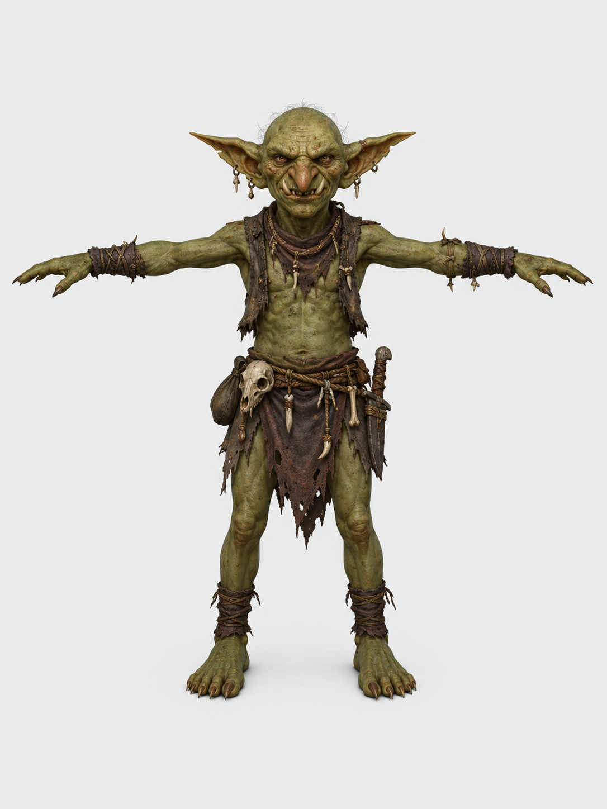

# Devlog - 2026-06-10

## Added Goblin

- Added the goblin as a new monster between the kobold and orc tiers.
- Created the 3D model on https://create.verse8.io/ and added it to the project as `client/public/models/monsters/goblin.glb`.

### Gameplay Details

- Level: 2.
- Behavior: brave, so it uses the direct chase and attack behavior.
- Weapon: `small_sword`.
- Weapon drop chance: 25%.

### Concept Art

- Generated the concept art with ChatGPT using this prompt: "d&d에 나오는 goblin 몬스터의 원화를 그려줘. 3d 캐릭터 제작의 원화로 사용할 것이니 T 포즈로 그려줘"

## Converted Player Control to an FSM

- Reworked player control because the old flow spread state across `playerState.state`, movement flags, pickup ids, combat state, and several update/event handlers.
- Centralized the transition rules in an explicit FSM so movement, keyboard control, combat, interaction, pickup, death, and jump feedback each have a clear owner.

### FSM Shape

- The player control machine now has eight states:
  - `idle`: no active player-control action.
  - `moving`: click-to-move, path following, chase movement, and far-pickup approach movement.
  - `keyboard_moving`: direct WASD movement.
  - `attacking`: in-range combat attack loop.
  - `object_interacting`: object interaction animations, such as sitting or social actions.
  - `picking_up`: pickup animation and item grab/finish handling.
  - `dead`: dead player state until respawn.
  - `jump_feedback`: short feedback state for rejected uphill movement.
- Inside `PlayerControl`, `PlayerControlMachine.update(...)` is the FSM's frame step. It drains queued events, handles interact/keyboard input when the editor is inactive, then runs the active state's tick handler.
- State changes go through `PlayerControlMachine.transition(nextState)`. Simple states transition by name, while data-owning states pass a full state object, such as a `moving` state with its movement target and path data.
- State definitions provide the per-state behavior hooks: `enter`, `exit`, `handleEvent`, `handleInteractKey`, `handleKeyboard`, and `tick`.

### Event and Animation Flow

- `GameScene` calls the public player-control entry point once per frame: `updatePlayerControl(deltaTime, { editorMode, events })`, which delegates to the machine update.
- Canvas intents, network callbacks, timers, and animation callbacks are converted into `PlayerControlEvent`s and consumed during the next player-control update.
- The animation-facing `PlayerState` contract remains separate from the control FSM state; the FSM converts its active control state into the existing render/model state shape.

### Related Files

- `client/src/lib/components/PlayerControl.svelte`: Svelte adapter that owns local player-control wiring and calls the FSM each frame.
- `client/src/lib/components/GameScene.svelte`: game-loop caller that now uses the single player-control update entry point.
- `client/src/lib/components/game-scene/GameScenePlayersLayer.svelte`: forwards animation callbacks back into player-control events.
- `client/src/lib/components/player-control/events.ts`: public player-control event types passed between scene components and `PlayerControl`.
- `client/src/lib/components/player-control/fsm/`: framework-independent FSM modules and tests.
- `client/src/lib/components/player-control/fsm/control-state.ts`: state-name union and data carried by active states.
- `client/src/lib/components/player-control/fsm/machine.ts`: event queue, frame update flow, lifecycle hooks, and explicit transition method.
- `client/src/lib/components/player-control/fsm/state-definitions.ts`: per-state hook registration for events, keyboard/interact handling, ticks, and cleanup.
- `client/src/lib/components/player-control/fsm/move-request.ts`, `movement-tick.ts`, `keyboard.ts`, `combat.ts`, `interaction.ts`, and `lifecycle.ts`: focused transition and frame helpers for each player-control behavior.
