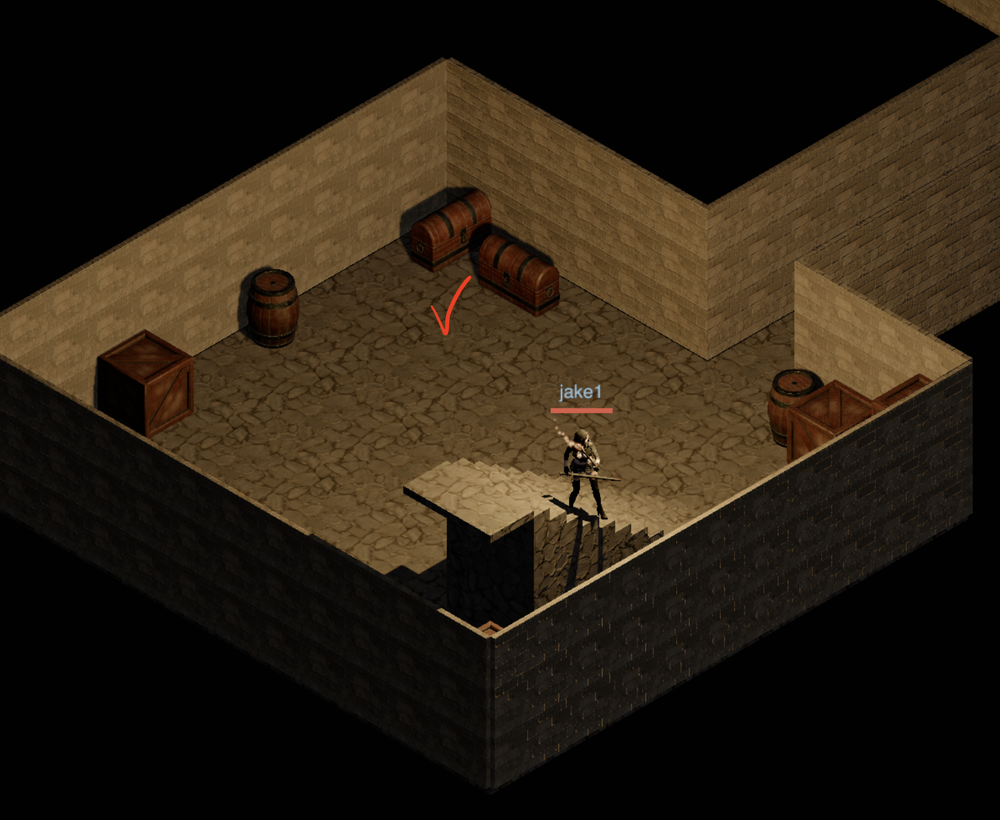

# Devlog - 2026-06-20

## Invisible Entrance Walls Stole Dungeon Clicks

There was an annoying dungeon movement bug around the entrance stairwell: while
standing inside the dungeon, clicking the floor area marked in red below did not
move the player into the room. Instead, the click resolved as if the player had
clicked back outside through the entrance, so the pathing request tried to leave
the dungeon.

The cause was not the visible floor tile. It was the hidden surface entrance
building still sitting in the dungeon scene graph. Three.js raycasts can still
hit invisible objects unless they are excluded, so the entrance shell's walls and
roof were able to intercept a click meant for the currently visible dungeon
floor. That bad hit landed near the surface entrance, and the click-to-move
logic interpreted it as a request to go back out.

The fix was to narrow the dungeon ground raycast target to the active floor
group only: the walkable slab and its stair shafts. The surface entrance shell,
decorative siblings, doors, and debug overlays are no longer part of the ground
target while underground. I also tightened the floor-resolution logic around the
entrance shaft so that, when the player is on or below the stair view, clicks
target the floor currently shown to the player instead of falling back to the
surface heuristic.
