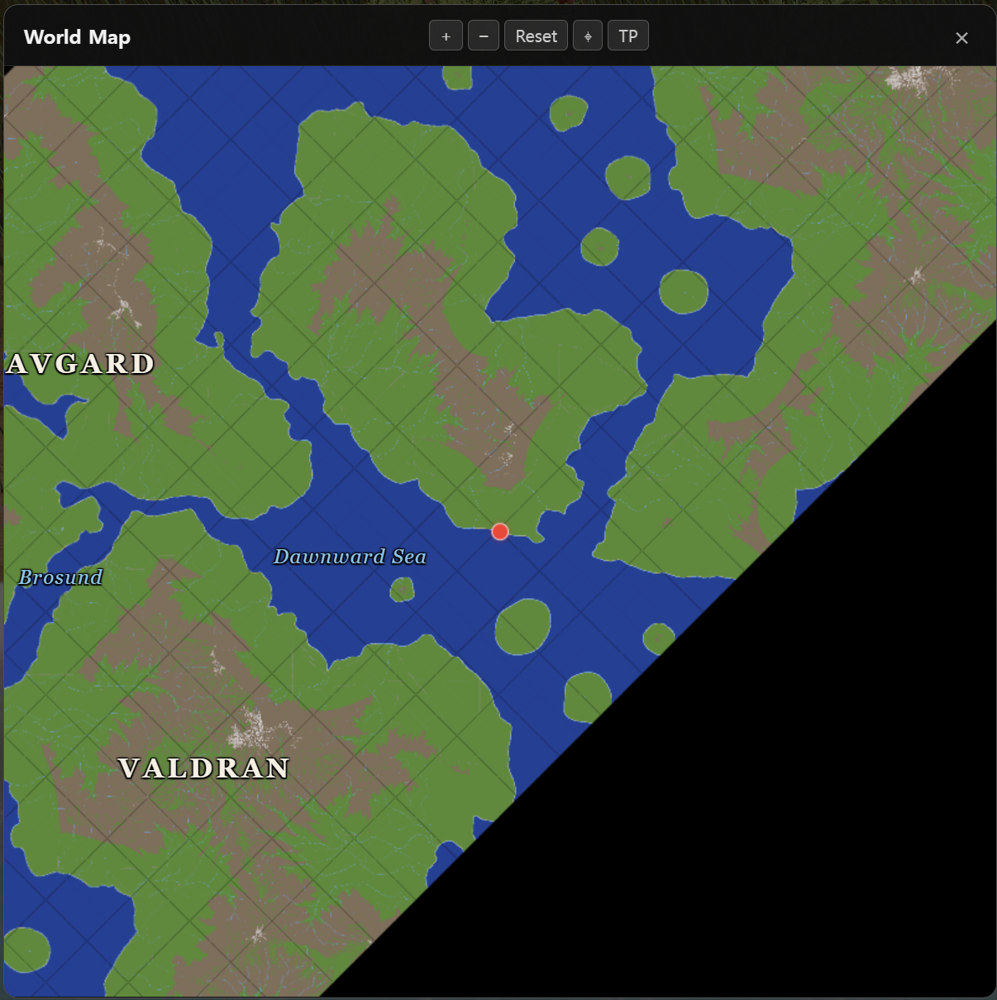

# Devlog - 2026-07-13

## Horizontal World Wrapping

The world now wraps horizontally. Crossing the eastern edge continues from the
western edge, and vice versa.

X wrapping had been only partially implemented, which exposed a flat fallback
surface at the boundary and left the map marker stuck at the edge. I completed
the missing terrain and gameplay handling so both sides now connect as one
continuous world.
