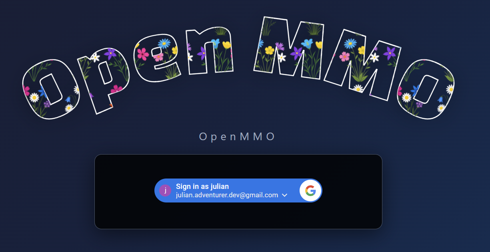

# Devlog - 2026-07-17

## Google Sign-In

Logging in is now done with your Google account. The login screen shows a
single **Sign in with Google** button; the server verifies the Google ID token
and maps it to your account.

The old password login is gone — it was retired for security reasons. New
accounts are created with a random `player_xxxxxx` name, and no email or
profile name from Google is stored on the server.
